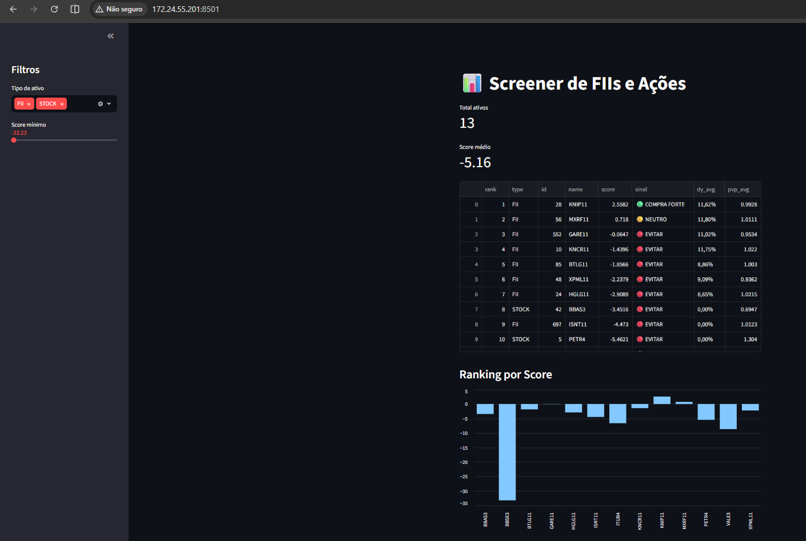

# 📊 Investment Screener (FIIs + Ações)

Projeto em Python que coleta, processa e ranqueia ativos financeiros (FIIs e ações) com base em indicadores fundamentalistas, gerando um score comparativo e dashboard interativo em Streamlit.

---

## 🚀 Objetivo

O objetivo do projeto é automatizar a análise de investimentos, consolidando FIIs e ações em uma única visão baseada em:

- Dividend Yield  
- P/VP  
- Liquidez  
- Vacância (FIIs)  
- ROE / ROIC (ações)  
- Tendências históricas dos indicadores  
- Score final de atratividade  

---

## 🧱 Arquitetura do projeto

```text
invest/
│
├── app.py                  # Dashboard Streamlit
├── main.py                 # Pipeline principal de coleta
├── config.py               # Configurações gerais
│
├── images/
│   └── dash.png            # imagem do dashboard da app.py
│
├── core/
│   ├── extractor.py        # Extração e parsing de dados
│   ├── score.py           # Cálculo de score
│
├── modules/
│   ├── fii.py             # Processamento de FIIs
│   ├── stocks.py          # Processamento de ações
│
├── registry/
│   ├── fii_map.py         # Map de FIIs (ID → ticker)
│   ├── stock_map.py       # Map de ações (ID → ticker)
│
└── data/
    └── screener.csv       # Base gerada

---

⚙️ Como funciona
1. O sistema consulta a API do Investidor10:
    * FIIs: /api/fii/historico-indicadores/{id}/5
    * Ações: /api/historico-indicadores/{id}/5/?v=2
2. Extrai indicadores como:
    * DY médio e tendência
    * P/VP
    * Liquidez
    * Vacância (FIIs)
    * ROE / ROIC (ações)
3. Calcula um score ponderado
4. Gera ranking e exporta CSV
5. Exibe dashboard interativo via Streamlit

---

📊 Exemplo de saída (CSV)

type	id	name	dy_avg	pvp_avg	score
FII	    28	KNIP11	11.62%	0.99	2.55
FII	    56	MXRF11	11.80%	1.01	0.71

---

📈 Dashboard

O dashboard exibe:
    * Ranking automático dos ativos
    * Sinal de investimento:
        🟢 Compra
        🟡 Neutro
        🔴 Evitar
    * Gráfico de score por ativo
    * Filtros por tipo (FII / Ações)

---

▶️ Como executar
1. Instalar dependências
    pip install requests pandas numpy streamlit tabulate
---
2. Rodar pipeline
    python main.py
---
3. Rodar dashboard
    streamlit run app.py

---

📦 Dependências
    requests
    pandas
    numpy
    streamlit
    tabulate

---

🧠 Lógica do Score

O score é calculado com base em pesos:
    * DY (peso positivo)
    * P/VP (peso negativo)
    * Vacância (FIIs)
    * Liquidez (positivo leve)
    * Tendência de indicadores
    * ROE / ROIC (ações)

---

📌 Observações
    * O sistema combina dados fundamentalistas + tendência histórica
    * FIIs e ações são tratados em pipelines separados
    * Nem todos os ativos possuem todos os indicadores (fallback aplicado)

---

📷 Preview



---

🔥 Próximas melhorias
    * Histórico de score ao longo do tempo
    * API própria (FastAPI)
    * Alertas automáticos (Telegram)
    * Carteira simulada
    * Otimização de pesos com backtesting

---

👨‍💻 Autor
Rogério Pelizari Haidamus
Projeto pessoal de análise quantitativa de investimentos.
